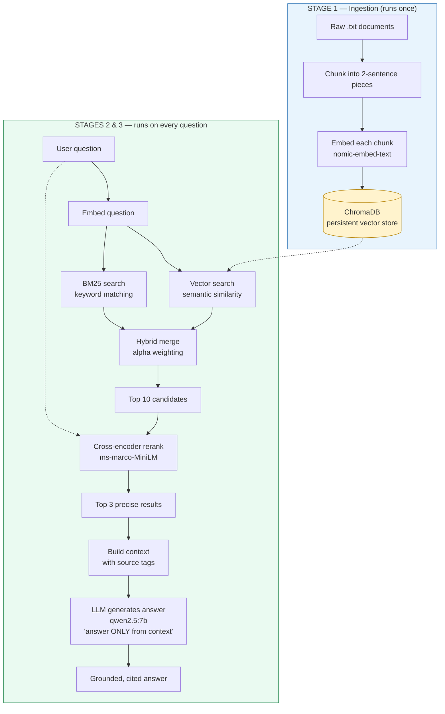

# RAG from Scratch

A complete Retrieval-Augmented Generation (RAG) pipeline built from first principles — **no LangChain, no LlamaIndex, no frameworks**. Every piece (embeddings, chunking, hybrid search, cross-encoder reranking, metadata filtering, and grounded generation) is implemented and understood directly.

Runs **fully local and free** using Ollama for models and ChromaDB for vector storage.

---

## What it does

Ask a natural-language question about a set of documents and get back a concise, **grounded answer with a source citation** — or an honest "I don't have that information" when the answer isn't in the documents.

```
Q: How do I cancel my subscription?
A: To cancel your subscription, go to Settings then Billing then Cancel Plan.
   Cancellation takes effect at the end of the current billing cycle.
   [Source: accounts.txt]
```

Even works when your wording doesn't match the document — asking "how do I **terminate** my subscription?" still returns the right answer about **cancelling**, because the cross-encoder understands they mean the same thing.

---

## Pipeline



The three stages:

| Stage | When it runs | What it does |
|-------|-------------|--------------|
| **1. Ingestion** | Once, on first run | Load → chunk → embed → store in ChromaDB |
| **2. Retrieval** | Every question | Hybrid search (vector + BM25) → cross-encoder reranking → top 3 |
| **3. Generation** | Every question | Inject chunks into prompt → generate grounded answer with citations |

Ingestion is **pre-computed once** so vectors persist on disk; retrieval and generation run per query.

> **Note on document updates:** In this version, ingestion runs only when the
> vector store is empty (`collection.count() == 0`). It does **not** auto-detect
> edited documents — if you change a file, delete the `chroma_db/` folder and
> re-run to re-ingest. Production systems handle this with change detection
> (file hashing), scheduled re-indexing, or webhooks, and use `upsert` to update
> only the chunks that changed.

---

## Retrieval techniques

This project implements three retrieval improvements over basic vector search:

### Metadata filtering
Each chunk is tagged with a category (billing, account, orders, general). Queries can be scoped to a specific category so irrelevant documents are excluded before similarity search even runs.

### Hybrid search (vector + BM25)
Vector search catches meaning ("terminate" matches "cancel"), BM25 catches exact terms ("order #4521"). Both scores are normalized to 0-1 and combined with alpha weighting:

```
final_score = alpha × vector_score + (1 - alpha) × keyword_score
```

Default alpha is 0.7 (70% meaning, 30% keywords).

### Cross-encoder reranking
After hybrid search returns the top 10 candidates, a cross-encoder (ms-marco-MiniLM) reads each query-document pair together and gives a precise relevance score. This catches nuances that bi-encoder similarity and keyword matching both miss:

```
hybrid search (fast, rough)  → top 10 candidates
cross-encoder (slow, precise) → top 3 results
```

---

## Tech stack

| Component | Choice | Why |
|-----------|--------|-----|
| Embeddings | `nomic-embed-text` (Ollama) | Free, local, 768-dim, lightweight |
| LLM | `qwen2.5:7b` (Ollama) | Strong instruction-following, runs locally |
| Vector store | ChromaDB | Persistent, zero-infra, similarity search |
| Keyword search | rank-bm25 | Standard BM25 implementation |
| Reranker | ms-marco-MiniLM (sentence-transformers) | Pre-trained cross-encoder for reranking |
| Math | NumPy | Vector operations |

---

## Setup

**1. Install Ollama** and pull the models:

```bash
ollama pull nomic-embed-text
ollama pull qwen2.5:7b
```

**2. Install Python dependencies:**

```bash
pip install chromadb ollama numpy rank-bm25 sentence-transformers
```

**3. Add your documents** — put `.txt` files in a `docs/` folder.

---

## Usage

```bash
python main.py
```

On the first run it ingests your documents into ChromaDB (one time). After that, it skips straight to answering questions — the vectors persist on disk.

```
What is your question? How long does shipping take?

Q: How long does shipping take?
A: Standard shipping takes 5 to 8 business days, and express shipping takes
   2 to 3 business days. [Source: shipping.txt]
```

---

## Project structure

```
.
├── config.py        # models, constants, ChromaDB client, reranker
├── ingestion.py     # load, chunk, embed, store documents
├── retrieval.py     # vector search, BM25, hybrid search, reranking
├── generation.py    # context building, LLM answer generation
├── main.py          # entry point — wires everything together
├── docs/            # source documents (.txt)
├── chroma_db/       # persistent vector store (gitignored)
└── README.md
```

Each file has one responsibility:

| File | Job |
|------|-----|
| config.py | Shared constants and clients used by all modules |
| ingestion.py | Getting documents into ChromaDB |
| retrieval.py | Finding the right chunks for a query |
| generation.py | Turning retrieved chunks into answers |
| main.py | Tying the pipeline together |

---

## How it works (the concepts)

- **Embeddings** — text is converted into 768-dimensional vectors where similar meaning produces similar vectors, enabling search by meaning rather than keywords.
- **Chunking** — documents are split into 2-sentence chunks so each retrievable unit is a self-contained idea, not a diluted average of a whole document.
- **Hybrid search** — combines vector similarity (catches paraphrases) with BM25 keyword matching (catches exact terms), normalized and merged with alpha weighting.
- **Reranking** — a cross-encoder reads each query-document pair together, catching subtle relevance that separate encoding misses.
- **Grounding** — the LLM is instructed to answer only from the retrieved context and to cite its source, which prevents hallucination.
- **Metadata filtering** — chunks are tagged with categories, allowing scoped retrieval that excludes irrelevant document types.

---

## What I learned building this

- How embeddings turn text into searchable vectors, and why cosine similarity measures meaning
- Why chunk size and strategy are the highest-impact decision in RAG quality
- The separation between one-time ingestion and per-query retrieval/generation
- How hybrid search (vector + BM25) covers both semantic and exact-match blind spots
- The bi-encoder vs cross-encoder distinction and why two-stage retrieval works
- How grounding instructions keep an LLM faithful to source documents
- Structuring an AI project into clean, single-responsibility modules

Built as part of a self-directed AI engineering track — deliberately without frameworks, to understand the moving parts before abstracting them away.