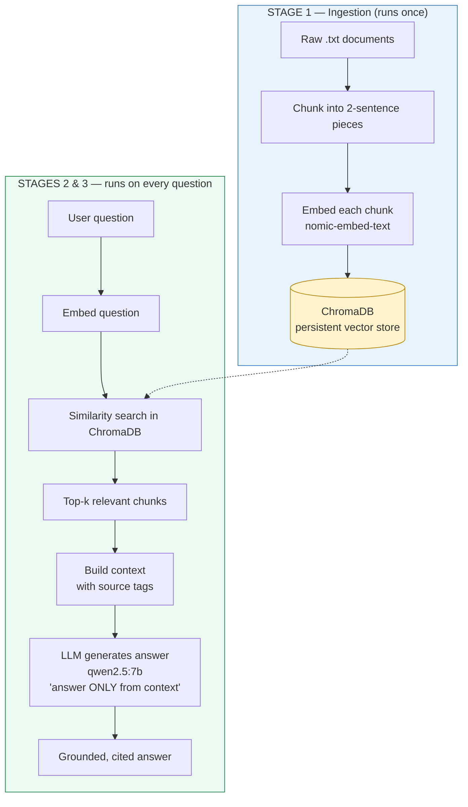

# RAG from Scratch

A complete Retrieval-Augmented Generation (RAG) pipeline built from first principles — **no LangChain, no LlamaIndex, no frameworks**. Every piece (embeddings, similarity search, chunking, retrieval, generation, and persistent vector storage) is implemented and understood directly.

Runs **fully local and free** using Ollama for models and ChromaDB for vector storage.

---

## What it does

Ask a natural-language question about a set of documents and get back a concise, **grounded answer with a source citation** — or an honest "I don't have that information" when the answer isn't in the documents.

```
Q: How do I cancel my subscription?
A: To cancel your subscription, go to Settings then Billing then Cancel Plan.
   Cancellation takes effect at the end of the current billing cycle.
   [Source: accounts.txt]
```

---

## Pipeline



The three stages:

| Stage | When it runs | What it does |
|-------|-------------|--------------|
| **1. Ingestion** | Once (or when docs change) | Load → chunk → embed → store in ChromaDB |
| **2. Retrieval** | Every question | Embed the question, find the top-k most similar chunks |
| **3. Generation** | Every question | Inject chunks into the prompt, generate a grounded answer |

Ingestion is **pre-computed once** so vectors persist on disk; retrieval and generation run per query.

---

## Tech stack

| Component | Choice | Why |
|-----------|--------|-----|
| Embeddings | `nomic-embed-text` (Ollama) | Free, local, 768-dim, lightweight |
| LLM | `qwen2.5:7b` (Ollama) | Strong instruction-following, runs locally |
| Vector store | ChromaDB | Persistent, zero-infra, real similarity search |
| Math | NumPy | Vector operations |

---

## Setup

**1. Install Ollama** and pull the models:

```bash
ollama pull nomic-embed-text
ollama pull qwen2.5:7b
```

**2. Install Python dependencies:**

```bash
pip install chromadb ollama numpy
```

**3. Add your documents** — put `.txt` files in a `docs/` folder.

---

## Usage

```bash
python main.py
```

On the first run it ingests your documents into ChromaDB (one time). After that, it skips straight to answering questions — the vectors persist on disk.

```
What is your question?
> How long does shipping take?

Q: How long does shipping take?
A: Standard shipping takes 5 to 8 business days, and express shipping takes
   2 to 3 business days. [Source: shipping.txt]
```

---

## How it works (the concepts)

- **Embeddings** — text is converted into 768-dimensional vectors where similar meaning produces similar vectors, enabling search by *meaning* rather than keywords.
- **Chunking** — documents are split into 2-sentence chunks so each retrievable unit is a self-contained idea, not a diluted average of a whole document.
- **Retrieval** — the question is embedded and compared against stored chunks via cosine similarity; the closest `k` are returned.
- **Grounding** — the LLM is instructed to answer *only* from the retrieved context and to cite its source, which prevents hallucination.

---

## Project structure

```
.
├── main.py          # the full RAG pipeline
├── docs/            # source documents (.txt)
├── chroma_db/       # persistent vector store (gitignored)
└── README.md
```

---

## What I learned building this

- How embeddings turn text into searchable vectors, and why cosine similarity measures meaning
- Why chunk size and strategy are the highest-impact decision in RAG quality
- The separation between one-time ingestion and per-query retrieval/generation
- How grounding instructions keep an LLM faithful to source documents
- Moving a vector store from in-memory to persistent storage

Built as part of a self-directed AI engineering track — deliberately without frameworks, to understand the moving parts before abstracting them away.
